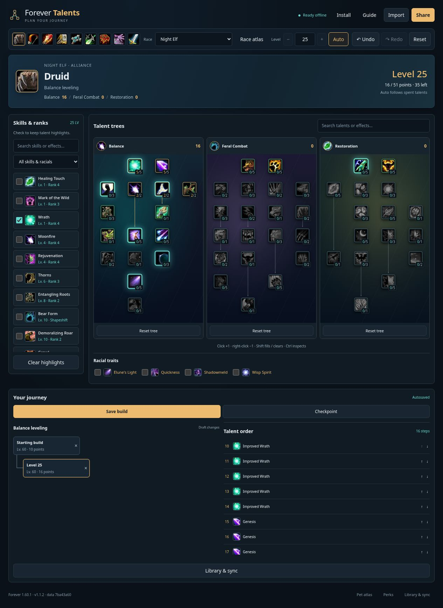
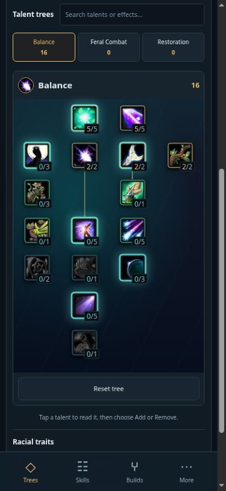
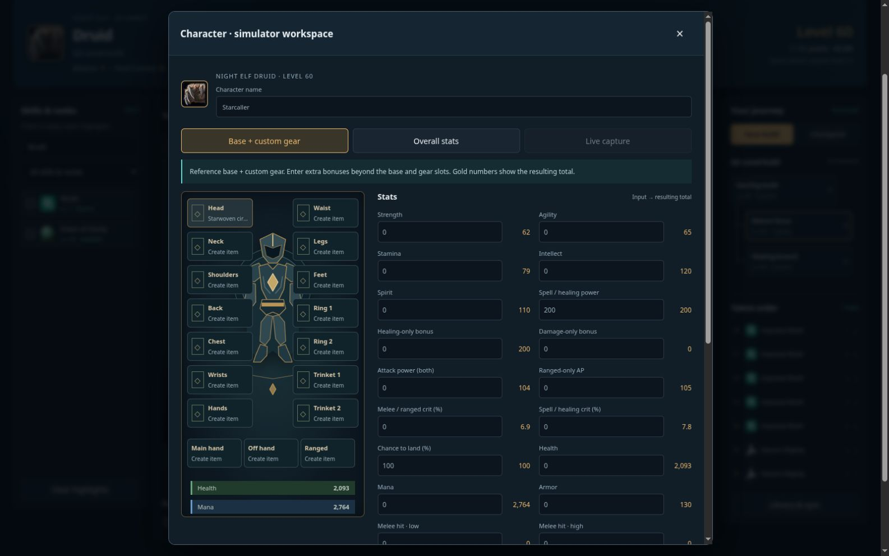
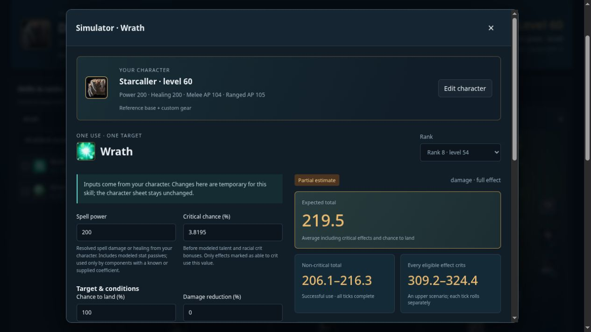

# Forever Talents

A free, unofficial talent planner for **World of Warcraft Forever**, with an in-game addon and an
installable web app for desktop and mobile. Not affiliated with or endorsed by Blizzard
Entertainment.

**On the release page, scroll to Assets and download `ForeverTalents.zip`.** Expand Assets if it is
collapsed. The **Source code** downloads are for developers.

## Features

- All nine classes, original talent layouts, rank descriptions and prerequisite checks.
- Search skills and racials, see rank unlock levels, and highlight related talents.
- Track your leveling order with Auto level, undo/redo and branching checkpoints.
- Share builds as text or through addon whispers. Transfer character stats or your entire saved
  library between the addon and web app.
- Build a central character with custom gear or live stats. Simulate individual skills with
  applicable inputs, calculation steps and clear accuracy notes.

## Install

Click the download button above, then choose **ForeverTalents.zip** under **Assets** on the release
page. Extract the **ForeverTalents** folder into your game's **Interface/AddOns** directory, enable
it in the AddOns menu, then type **`/ftc`** in game. No other addons are required.

To update, replace the addon folder. Keep your `WTF` folder—it contains your saved builds. See the
[addon guide](addon/ForeverTalents/README.txt) for controls and sharing.

## Web and mobile

The web app uses the same talent rules and data. Install it from your browser and use it offline
once it says **Ready offline**. Saves stay on your device; export your library to back it up or move
it between devices. No account is needed.

[Web guide](web/README.md) · [GitHub Pages hosting](docs/HOSTING.md)

## Screenshots

Desktop web app:

Mobile web app

Character and Simulator (web)

Character and Simulator share a central gear/stat workspace. Try skill changes temporarily and
inspect the formulas, sources and accuracy notes. See the [simulator guide](docs/SIMULATOR.md).

## Development and license

See [CONTRIBUTING.md](CONTRIBUTING.md) for setup, builds and tests.

Code is [MIT licensed](LICENSE.txt). Game data and artwork retain their owners' rights; see
[NOTICE.txt](NOTICE.txt). The bundled data covers Forever **1.60.1**. Damage and healing results are
estimates for individual skill uses.
